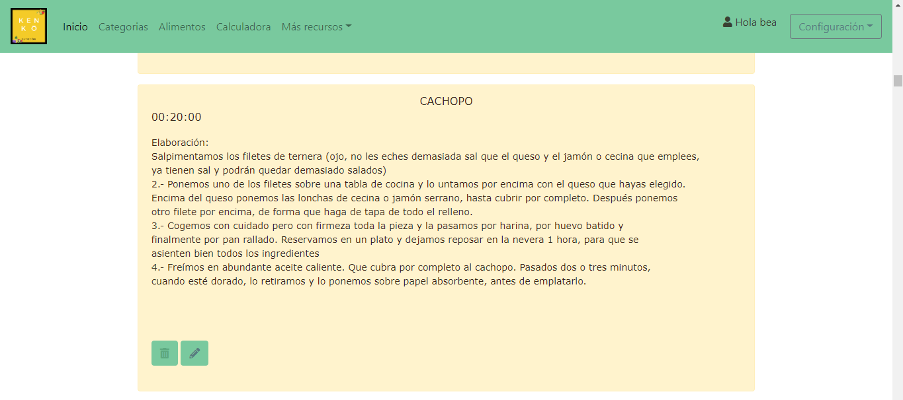
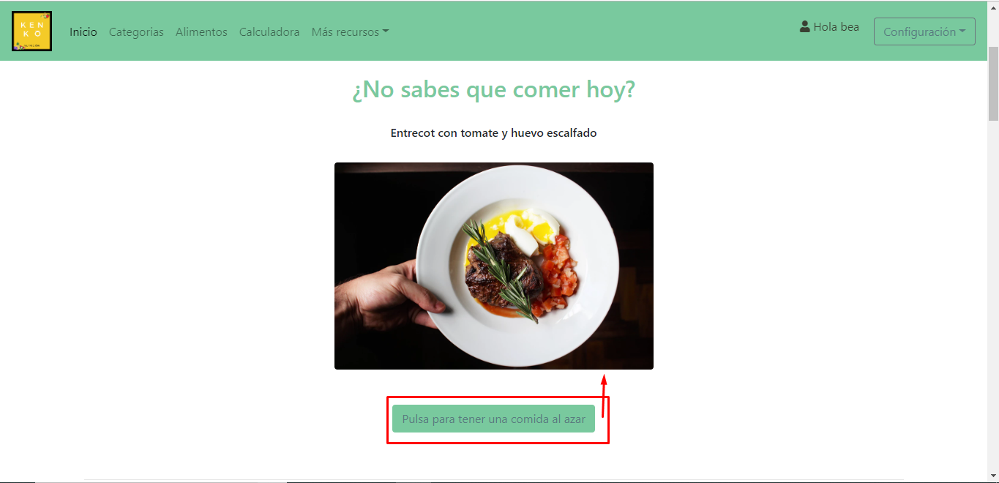
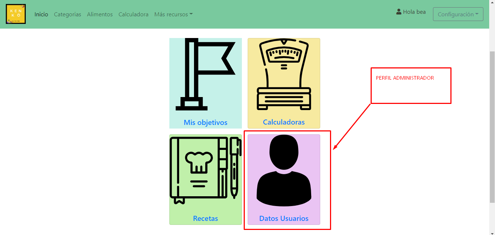

# KenkoNutricion
Proyecto Final del Ciclo de Grado Superior de Desarrollo Web   :watermelon:  :lemon:

Se puede acceder a la página desde aquí. ->  [Kenkō nutrición](https://www.nutricion.at/){:target="_blank"}

# Kenkō nutrición  


  * [Introducción al proyecto](#introducción-al-proyecto)
  * [Explicación del proceso de desarrollo](#explicación-del-proceso-de-desarrollo)
  * [Herramientas y tecnologías utilizadas](#herramientas-y-tecnologías-utilizadas)
  * [Demostración de funcionamiento de la aplicación](#demostración-de-funcionamiento-de-la-aplicación)


## Introducción al proyecto 
La página web Kenkō  nutrición es el proyecto final del Ciclo de Grado Superio de Desarrollo de Aplicaciones Web. El proyecto presenta una web con diversas funcionalidades, según quién sea el usuario que la visite. 
Encontamos tres tipos de vistas:
1. Usuario sin loguearse.
2. Usuario logueado.
3. Usuario administrador.

Página realizada para el futuro uso de una nutricionista.

> La salud es un estado de completa armonía de cuerpo, mente y alma


## Explicación del proceso de desarrollo

### Arquitectura del sistema
Uso del archivo POPULATE de PHP una única vez, para insertar datos en mi tabla alimentos desde una API pública llamada TACO con Json. (https://taco-food-api.herokuapp.com/).

Mi proyecto se estructura en el Modelo Vista Controlador, con el uso de Ajax, y jquery. Tengo un index principal, que crea una instancia de App y extraigo de la url separando por parámetros en controlador, método y parámetros a pasar al método y controlador correspondiente. De esta forma se crea una instancia al controlador correspondiente que hereda de un controlador padre y este controlador padre crea a su vez una instancia de la vista y del modelo general. El controlador concreto de una pagina, se dirige al modelo mandando datos que obtengan de un formulario si es el caso o solo llama al modelo para traer datos. El modelo hereda del modelo padre, el cual el controlador padre creo una instancia, para llamar a los modelos con el nombre del controlador seguido de la palabra ‘model’, que se le concatena. El modelo concreto hace una llamada a base de datos y devuelve datos al controlador en forma de respuesta. Y es entonces cuando el controlador redirecciona los datos a la vista, que hereda de la vista general.

<p align="center">
 Esta explicación se sintetiza en este esquema.

</p>

Para la realización del proyecto, he usado distintas librerías como phpmailer o mpdf. Para usar ambas, hay que instalar primero composer (https://getcomposer.org/download/).
En la terminal del proyecto instalo composer.phar  a través de los siguientes comandos:

```php
php -r "copy('https://getcomposer.org/installer', 'composer-setup.php');"
php -r "if (hash_file('sha384', 'composer-setup.php') === '48e3236262b34d30969dca3c37281b3b4bbe3221bda826ac6a9a62d6444cdb0dcd0615698a5cbe587c3f0fe57a54d8f5') { echo 'Installer verified'; } else { echo 'Installer corrupt'; unlink('composer-setup.php'); } echo PHP_EOL;"
php composer-setup.php
php -r "unlink('composer-setup.php');"

```
Para enviar correos, instalo phpmailer (https://github.com/PHPMailer/PHPMailer 
) y configuro el correspondiente archivo php con los datos necesarios para que el usuario pueda enviar un correo de contacto.
Para poder descargar en pdf los menús uso mpdf (https://mpdf.github.io/installation-setup/installation-v7-x.html#).

### Ejemplos de codigo

*Objetivos*

<p align="center">

 
</p> 


Uso de jquery y ajax en el generador de un menú aletorio:

```javascript
function getRandomToEat()
{
   var randomToEat = foods[Math.floor(Math.random()* foods.length)];
   $('#foodShow').html(randomToEat.title);
   $('#photo').attr('src', randomToEat.link); 
}
```
<p align="center">

</p> 

Controlador con phpmailer para que el usuario pueda enviar un correo de contacto:

```php
function sendEmail()
{  
        if (isset($_POST['name']) && isset($_POST['email']) && isset($_POST['comment'])) {

            $name = trim($_POST['name'])?? " ";;
            $email = trim($_POST['email'])?? " ";;
            $comment = trim($_POST['comment'])?? " ";;
 
            if (!empty($name) && !empty($email) && !empty($comment)) {
                $mail = new PHPMailer(true);
                try {
                    $mail->SMTPDebug = 2;
                    $mail->isSMTP();
                    $mail->Host = ' smtp.office365.com';
                    $mail->SMTPAuth = true;
                    $mail->Username = 'mail@hotmail.com';
                    $mail->Password = '*********';
                    $mail->SMTPSecure = 'tls';
                    $mail->Port = 587;
                    $mail->setFrom('mail@hotmail.com', 'Mailer'); 
                    $mail->addAddress('otherMail@gmail.com', 'Mailer');
                    $mail->isHTML(true);                                 
                    $mail->Subject = 'Correo de contacto de Nutricion';
                    $mail->Body    = 'Nombre: ' . $name . '<br/>Correo: ' . $email . '<br/>' . $comment;
                    $mail->send();
                    $message = 'El mensaje ha sido enviado correctamente.';
                    $this->view->message = $message;
                    $this->view->render('contact/index');
                } catch (Exception $e) {
                    $message = 'El mensaje no se pudo enviar. Mailer Error: '. $mail->ErrorInfo;
                    $this->view->message = $message;
                    $this->view->render('contact/index');
                }
            } else {
                $message = "<h3 style='color:red'>Ha habido algún problema con los datos. Intentalo de nuevo.</h3>";
                $this->view->message = $message;
                $this->view->render('contact/index');
            }
          
        }

```
<p align="center">

</p> 

*Calculadora*
<p align="center">

</p> 

*Galeria*
<p align="center">

</p> 

*Gestión de recetas*
<p align="center">

 
</p> 

*Registro*
<p align="center">

</p> 


### Modelo de datos
Modelo de datos basado en la extensión PDO de PHP. 
El tipo de base de datos usado es MySQL. Para crear la base de datos se emplea el lenguaje de definición de datos (Data Definition Language, DDL) de SQL que permite definir las estructuras de la base de datos que almacenarán los datos. 
La base de datos creada es una base de datos relacional, llamada nutrición con 7 tablas: Alimento, categoria, usuario, objetivo, objetivo_personal, receta y  lista_recetas.

<p align="center">
 Estructura de la base de datos


</p>

## Herramientas y tecnologías utilizadas

[Esquema de tecnologias](imagenes/esquematecnologias.png)

**Back:**
* PHP

**Front:**
* Jquery
* Ajax
* HTML5 / CSS
* Canva

**Editor de textos:**
* VisualStudio Code
* Sublime Text
* Notepad++

**Base de datos:**
* MySQL.
* phpMyAdmin.
* MySQL Workbench.

**Uso de un servidor local con gestión de base de datos:**
* Xampp


## Demostración de funcionamiento de la aplicación

Estructura del proyecto basada en MVC y PDO.

### Funcionalidades y características

La aplicación se compone de una vista principal en la que se hace una introducción a la nutrición y alimentación (Main). También, tenemos las páginas de categorías, alimentos y calculadoras y en más recursos, tenemos recetas y contacta con nosotros. Todas estas páginas pueden visualizarse sin necesidad de loguearse en la página web.

Para acceder a más contenidos y poder interactuar, hay que registrarse. El registro desde la web, genera un usuario normal, además de los usuarios normales, tenemos el administrador o administradores, que se generan desde la base de datos por medio de phpMyAdmin. De esta forma generamos un usuario administrador.

El usuario administrador tiene funcionalidades tales como registrar usuarios comunes o de tipo admin, modificar usuarios, y eliminarlos. Otra funcionalidad que se le permite al usuario administrador es poder crear recetas, modificarlas y borrarlas.

El perfil de administrador está pensado para que lo use la nutricionista y pueda, ver que usuarios existen y poder crear nuevas recetas.

El perfil del usuario puede realizar diversas tareas, como guardar y eliminar las recetas que le gusten en su lista de recetas. Además, cada día puede incluir los objetivos que cumple y ver en gráficos por meses, cuantas veces ha cumplido un objetivo como beber agua, por ejemplo. 

El perfil del usuario puede ver los menús que se generan aleatoriamente, y descargarse en pdf los tres tipos de menús disponibles.

Todos los usuarios pueden ver el índex principal de introducción, las categorías de los alimentos con su información, las calculadoras y  los alimentos paginados y su buscador por nombre o categoría. Del mismo modo, todos los usuarios pueden ver las recetas y enviar un correo de contacto a la nutricionista.

### Funcionalidades por página

*	Main o Inicio:
En esta página muestro una introducción a la nutrición y  esquemas de alimentación.
<p align="center">

</p>

*	Categorías: 
Se presentan las distintas categorías de los alimentos con una breve descripción de cada una y se muestra aquí una galería de fotos.
<p align="center">


</p>

* Alimentos:
Esta página contiene una lista con 650alimentos extraido de la API TACO, se encuentran en portugues la mayoría, para hacer pruebas con el buscador, he traducido alrededor de unos 200 y pico alimentos.
Se pueden ver aquí, los alimentos con sus características y hacer una búsqueda por nombre de alimento o por la categoria.
<p align="center">


</p>
*	Calculadoras:
Encontramos 3 calculadoras, que se pueden cerrar y por defecto aparecen abiertas.
En las calculadoras se puede realizar el  cálculo del IMC o del gasto de energía basal.
Pedimos datos como el peso en Kg, Altura en Metros y la edad y al pulsar en el botón muestro el resultado del cálculo que se haya solicitado.
<p align="center">


 
</p>
*	Recetas:
Se muestra una lista de recetas almacenada en base de datos con sus respectivos tiempos y elaboración.
 1.	Usuario sin registrar.
Solo puede ver las recetas.
<p align="center">

</p> 
 2.	Usuario registrado.
Puede guardar la receta y cuando la guarda, le aparece en la página de mis recetas. Desde la página mis recetas también puede borrarlas.
<p align="center">

</p> 
 3.	Usuario administrador.
Puede crear nuevas recetas, modificar las que existen y borrarlas las ya creadas.
<p align="center">




</p>

*	Mis recetas.
o	Esta página solo aparece para los usuarios registrados que no son administradores.
El usuario registrado puede guardar desde la página de recetas, la que le guste y tenerla en su lista de recetas.

<p align="center">

</p> 

*	Menú:
 1.	Usuario registrado y administrador pueden acceder a esta página.
Pueden pulsar el botón para que genere un menú de comida aleatoria.
Hay tres menús que pueden descargarse en pdf.
<p align="center">

 


 
</p> 
*	Objetivos:
 1.	Pueden acceder usuarios registrados y el administrador.
Podemos seleccionar los objetivos que hemos cumplido en el día y se guarda automáticamente en la base de datos con la fecha actual.
Además, podemos ver el objetivo que deseemos, cuantas veces lo hemos cumplido por meses en este año, a través del generador de gráficos.
También, se puede generar un gráfico con todos los objetivos cumplidos en el año.
Por último, se muestra una tabla con objetivos cumplidos y podemos borrarlos.
<p align="center">


 
</p>
*	Contacta con nosotros:
Aquí, muestro un formulario de contacto validado que envía un correo al nutricionista.
<p align="center">

</p>
*	En Configuración: Administrar perfil
Tenemos acceso  a diversos recursos antes mencionados.
<p align="center">

</p>
 Tanto usuario registrado como el administrador ven en esta página Mis objetivos y Calculadoras.
 2.	El administrador  ve además:
Recetas y Datos de usuarios
<p align="center">

</p>
 3.	El usuario registrado ve:
Mis recetas, y Mis datos.
<p align="center">

</p>
*	Mis datos:
Esta página la ve solo el usuario registrado a través de configuración desde el navbar, Mis datos.
Aquí aparecen sus datos de registro y puede modificarlos todos menos la contraseña.
<p align="center">

</p>
*	Datos usuarios:
Esta página solo se puede acceder si el usuario está logueado y es administrador.
Aquí, encontramos una tabla con todos los usuarios registrados. El administrador puede crear usuarios comunes o administradores, puede modificar los usuarios  y darles permisos de administrador  o quitarlos, y puede borrarlos.
Para que el administrador pueda borrar los datos de los usuarios, en el código he tenido que realizar varias consultas a base de datos, ya que el usuario, tiene un id que actúa como clave foránea en la tabla de los objetivos personales y de la lista de recetas. De esta forma hay que eliminar todos sus objetivos personales y todas sus recetas guardadas para poder eliminar al usuario.

<p align="center">


</p>

* Página de registro:
Contiene un formulario para registrar usuarios y está validado con jquery validator. También, incluyo aqui en la cabecera del formulario una transición realizada en css con dos svg.
<p align="center">

</p> 

* Pagina de login:
Contiene el formulario de inicio de sesión. Y al loguarte, te redirige a la página de Area personal en el caso del usuario comun y si eres el administrador, te lleva a administrar perfil.
<p align="center">

</p> 
